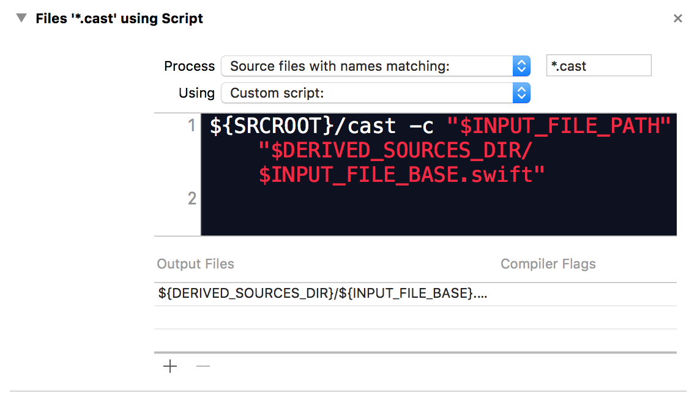
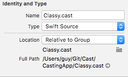

# JSON Cast

Easily create classes from parsed JSON and conform to NSCophing and NSEncoding. In a nutshell using JSON Cast you create a .cast file that is basically a swift definition of your class properties and cast will create a .swift file from it that has the necessary init methods to init from a JSON data or string, init from a dictionary as well as optionally NSCoding. Added as an Xcode build rule so swift files are automatically generated whenever the cast file is updated.

- Supports swift class or struct (NSCoding / NSCopying only supported with classes)
- Supports let or var properties
- Supports any enum type - enums backed by other types are automatically supported while any other swift enum can be easily supported
- Automatically map JSON keys to properties based on property names, or easily add custom key mappings.
- Supports required and optional JSON keys

## Basic Usage

Create a .cast file with your properties as follows:

	class A: DictionaryConvertible {
		let b: Int
		let c: String?
		let d: NSURL //! "url"
	}
	
Will create a class that confrms to the DistionaryCpnvertible porotocol that is mapped from a dictionary that has a key `"b"` that holds an Int, it can either be a number or a string that is converted to a number, the key `"c"` is optional and may not appear in the dictionary, it holds a string value, and a key `"url"` that is mapped to the property `d` in code. You need never need to look at the generated file, it's not important. Add your methods in a different file as an extension to class A.

## Install

1. clone this repository.
1. Add the Cast project to your workspace.
1. For iOS projects, link with the Cast.framework, tvOS projects need to link with CastTV.framework and OSX projects with CastX.framework
1. Add a build rule to convert *.cast files as follows:

  
 
 Do source files matching *.cast, use script and type the following script:
 
    ${SRCROOT}/cast -c -n "$INPUT_FILE_PATH" "$DERIVED_SOURCES_DIR/$INPUT_FILE_BASE.swift"

 In the output files put `${DERIVED_SOURCES_DIR}/${INPUT_FILE_BASE}.swift` as the output file.

Now create the cast script, in terminal cd to your project dir and type:

    ln -s path/to/cast-script/main.swift cast
    
Now try adding a .cast file to your project and it should compile.

###Command line options:

The cast scripts accepts the following command line options:

__-c__  
Capitalize the key names, so a property named "age" will use the key "Age". Without the -c key names are the same as property names, that is the property "age" will use the key "age." 

__-i__  
Case insensitve keys. The keys in the dictionary are case insensitve, so the property "age" will match the key "Age" or "AGE" or any case variation.

__-n__  
If the -n command line option is specified, empty strings in the JSON (e.g. `"a": ""`) will be mapped to nil String? values. Without it the will map to empty strings.

## Advanced Usage

### The Cast File 

The cast file is a swift class file that contains only class or struct declerations with their properties. When defining a class it should declare itself conforming to the DictionaryCpnvertible protocol. If it does not, the script assumes it inherits from a DictionaryConvertible conforming class and will call super on the DictionaryConvertible methods.

The DictionaryConvertible protocol defines two methods, init?(dictionary: [String: AnyObject]) is an initializer from a dictionary, it is failable and will return nil if the dictionary does not contain all the required keys. Any property that is defined as non-optional with no default value is assumed to be required. It also defines a dictionaryRepresentation() method that returns a dictionary representing the object. Two additional convenience initialzers are defined in DictionaryConvertible, init?(json: String) and init?(json: NSData) that will use NSJSONSerialization to convert the json to a dictionary and call the init with dictionary method.

### Properties

Each property can be defined with a let or var and must include a type, the script isn't as smart as the compiiler in inferring types. You can add a default value with `= value` If you want to define a special key mapping add the key in a comment, such as `//! "Key" or `//! "Level1/Level2/Key"` to define a key path into the dictionary, that is the key Level1 is assumed to contain a dictionary that has the key Level2 which is a dicionary which has the key "Key" which contains the value.

Each property can have a default value which is assigned if the corrosponding key is not found in the dictionary. Default values are provided as an initial value in swift, e.g. `let x:String = "default"`

Properties that are defined as optional or properties that are not optional but have a default value are also treated as optional meaning if the corrosponding key is not found in the dictionary, the default value is used. Required properties will cause the init to fail and return nil if their corrosponding key is missing from the dictionary.

if you annotate a property decleration with a `//! ignore` comment, it will be ignored by the cast script and will not be included in the nscoding encoding and in the init from dictionary. Since extensions cannot add stored properties to a class, you can use this to add stored properties which are derived from other properties so are not in the dictionary.

Here is a summary of the different property declerations:

	class AnObject: DictionaryConvertible {
		let a: Int
		let b: String?
		var c: Int = 0
		let d: [int]  //! "Other"
		var e: NSURL? //! ignore
	}
	
In this definition we have a readonly property a that will be initialized from the key "a" in the dictionary, and is required. If the dictionary does not have a key "a" the init will fail. The property b is a String and is optional, if the dictionary does not have a key "b", b will be nil. The read-write property c is an int, if the dictinary does not have a key "c", c will be assiged the default value of 0. The property d will be initialized from the key `Other` in the dictionary that should contain an array of integers , and the property e is a derived property that will not be included in the initializer.

### Supporting Enums

To add enums backed by compatible types, add the enum decleration to the .cast file. For example:

	enum Option: Int {
		case OptionZero
		case OptionOne
	}
	
	struct AnObject: DictionaryConvertible {
		option: Option?
	}
	
Will read the option from the dictionary for an Option enum backed by Int.

Adding support for other swift enums requires adding an extension to the Mapper class to support the new type, see the Mapper extension section.

### Mapper

The generated code uses a Mapper class to do the mapping between dictionary values and property values. To support a new property type add an extension to the Mapper class with two functions:

	class func map(object: AnyObject) -> Type?
	class func unmap(object: Type) -> AnyObject?
	
The map function is used when converting values in the dictionary to prorerty values. It is given the value in the dictionary as the object argument and may return nil to indicate the value couldn't be converted. The funcion unmap does the reverse, given a value, convert it to it's dictionary value. For example adding support for NSDate values, converting them from an integer representing the number of seconds in January 1970, and the integer can either be expressed as a number in JSON or as a string representing the number:

	extension Mapper {
	    class func map(object: AnyObject?) -> NSDate? {
	        switch object {
	        case let x as String:
	            return NSDate(timeIntervalSince1970: NSTimeInterval(x)!)
	
	        case let x as Int:
	            return NSDate(timeIntervalSince1970: NSTimeInterval(x))
	
	        case let x as NSDate:
	            return x
	
	        default:
	            return nil
	        }
	    }
	}
	
You can extend Mapper to support any new custom type you have. By default Maper supports any type conforming to DictionaryConvertible so classes you defined in cast files will automatically work as property types in other classes.

### AwakeFromDictionary

By adding a `//! awake` comment to the class / struct decleration the init will call an `awakeFromDictionary(dict: [String: AnyObject]) -> Bool` functionary passing it the dictionary that was used to initialize the object. If the function returns true the init will succeed, if it returns false the init will fail. You can use the awakeFromDictionary method to perform last value validations after the dictionary is parsed as well as compute any derived value you need or do any post processing after the dictionary is read.

### Adopting NSEncoding and NSCopying

To adopt NSCoding your oject has to be an objective-c compatible object (a limitation of the NSEncoding protocol), so it must inherit from NSObject. To adopt NSCoding, simply add it to the list of protocols your class conforms to and the appropriate init and encodeWithCoder functions will be generated.

To Adopt NSCopying add it to the list of protocols your class conforms to. A copyWithZone function will be generated. The NSCopying code relies on the NSCoding adoption, you must also adopt NSCoding to support NSCopying.

### Inheritence

To inherit from a class that supports DictionaryConvertible use the parent class name in the inheritene decleration, don't add a DictionaryConvertible decelration to the protocol list. Be not adding a DictionaryConvertible decleration, the script knows that a parent class declares it and will use the approprate calls to super in the init and dictionaryRepresentation() functions.

If you are also adopting NSCoding, in inherited classes, don't add the NSCoding propcol to the protocol list, instead add a `//! nscoding` comment to the class decleration. This will cause the script to call super in the NSCoding methods.

No special action is need to support NSCopying in inherited class. NSCopying works on inherited classes as it used the NSCoding functions.

### Cast File Editing

By default Xcode treats the cast file as plain text and wlll not syntax highlight it. You can change that by setting it to swift source in the file inspector.

## Swift 3

JSON Cast is Swift 3 ready! If you are working with Xcode 8 beta and Swift 3 there is a Swift3 branch you can use which is compatible.

